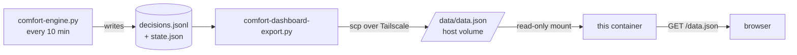

# Maison · Confort

Read-only dashboard for the house comfort engine: current state per zone and
7 days of history — temperature curves against the comfort band, and a strip of
what the engine was doing, minute by minute.


The interface is in French; the code and documentation are in English.

---

## How the data gets here

The engine runs at home, on a machine that nothing outside can reach. So the
data is **pushed**, never pulled:



Consequences worth knowing before changing anything:

- **There is no write endpoint.** Nothing here accepts a POST, so there is no
  ingest route to authenticate and nothing to punch through the access layer in
  front of the domain. Adding one would create both problems at once.
- **The payload is not in the image.** A redeploy never touches the data, and a
  broken push never takes the page down — it just goes stale, which the header
  says out loud.
- **Rolling back is stopping the push.** The container keeps serving the last
  payload it received.

## The payload

One JSON object, ~66 kB for 7 days and 6 zones. Everything the page displays
comes from it — zone names, comfort bands, action labels and emojis included.
That is deliberate: the page holds no knowledge of the house, which is what
lets this repository be public.

Timestamps are a shared axis (`t`, epoch seconds, one entry per engine tick).
Per-zone series align to it index by index, with `null` where a zone has no
reading. Bands and actions are run-length encoded (`[[value, count], ...]`)
because they stay constant for hours; expanding them is three lines in `app.js`.

The action vocabulary (`actions`) is exported straight from the engine's own
table, so a new action shows up here with its emoji and French label without
anyone editing this repo.

## Deploy

Built and served by Coolify from this repository. The one piece of
configuration that is not in the Dockerfile: a **volume mapping the host
directory that receives the pushed payload onto `/data`**. Without it the page
loads and reports that it is waiting for data.

## Local run

```sh
docker build -t maison . && docker run --rm -p 8080:80 \
  -v "$PWD/sample:/data" maison
```

Or, with no Docker at all — the frontend is static files:

```sh
cd frontend && python3 -m http.server 8899   # expects a data.json alongside
```
