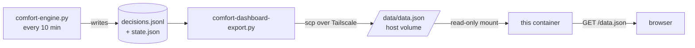
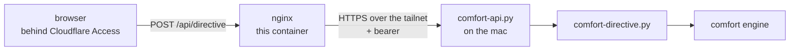

# Maison · Confort

Dashboard for the house comfort engine: current state per zone and 7 days of
history — temperature curves against the comfort band, and a strip of what the
engine was doing, minute by minute. Plus a handful of buttons to override it.


The interface is in French; the code and documentation are in English.

---

## How the data gets here

The engine runs at home, on a machine that nothing outside can reach. So the
data is **pushed**, never pulled:



Consequences worth knowing before changing anything:

- **Nothing writes the payload but the push.** There is no ingest route, so a
  broken push cannot be papered over from the outside, and there is nothing to
  authenticate on the read path.
- **The payload is not in the image.** A redeploy never touches the data, and a
  broken push never takes the page down — it just goes stale, which the header
  says out loud.
- **Rolling back is stopping the push.** The container keeps serving the last
  payload it received.

## How an action gets back

Reading is one direction; the buttons are the other, and they take a different
road. The browser only ever calls **its own origin** — `/api/...` — and knows
nothing about where the house is. nginx is the backend: it proxies that prefix
to a small API on the mac, adding a bearer the page never sees.



Why it is shaped like that:

- **The mac listens on loopback only.** It is published on the tailnet by
  `tailscale serve`, which terminates TLS with a real certificate. Nothing is
  exposed to the internet, and no port is opened on the machine.
- **The bearer stays server-side.** It is an environment variable of this
  container (`COMFORT_API_TOKEN`); the container refuses to start without it,
  because a container that boots with an empty bearer looks healthy while every
  button silently answers 401.
- **No validation happens here.** The API on the mac owns the allowlist of verbs
  and the meaning of a directive. A second check in this repo would be a second
  authority, free to drift from the first.
- **A 200 is not proof.** If the upstream URL is wrong, the tailnet serves a
  different app and answers 200 with HTML. The page checks the JSON shape, not
  the status code.
- **The read path does not depend on the write path.** With the API down, `/api/`
  answers 502 and the page still shows the house — the measurements arrive by
  the push, which is untouched.

Two environment variables are required: `COMFORT_API_URL` (up to and including
the `/comfort` path) and `COMFORT_API_TOKEN`.

## The payload

One JSON object, ~66 kB for 7 days and 6 zones. Everything the page displays
comes from it — zone names, comfort bands, action labels and emojis included.
That is deliberate: the page holds no knowledge of the house, which is what
lets this repository be public.

Timestamps are a shared axis (`t`, epoch seconds, one entry per engine tick).
Per-zone series align to it index by index, with `null` where a zone has no
reading. Bands and actions are run-length encoded (`[[value, count], ...]`)
because they stay constant for hours; expanding them is three lines in `app.js`.

The action vocabulary (`actions`) is exported straight from the engine's own
table, so a new action shows up here with its emoji and French label without
anyone editing this repo.

## Deploy

Built and served by Coolify from this repository. The one piece of
configuration that is not in the Dockerfile: a **volume mapping the host
directory that receives the pushed payload onto `/data`**. Without it the page
loads and reports that it is waiting for data.

## Local run

```sh
docker build -t maison . && docker run --rm -p 8080:80 \
  -v "$PWD/sample:/data" maison
```

Or, with no Docker at all — the frontend is static files:

```sh
cd frontend && python3 -m http.server 8899   # expects a data.json alongside
```
